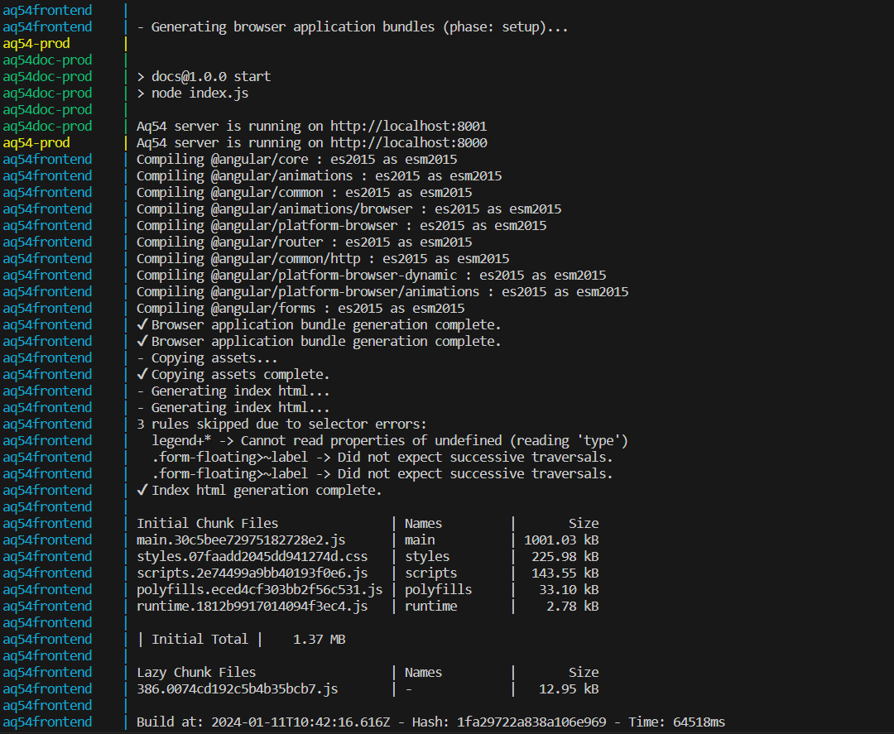
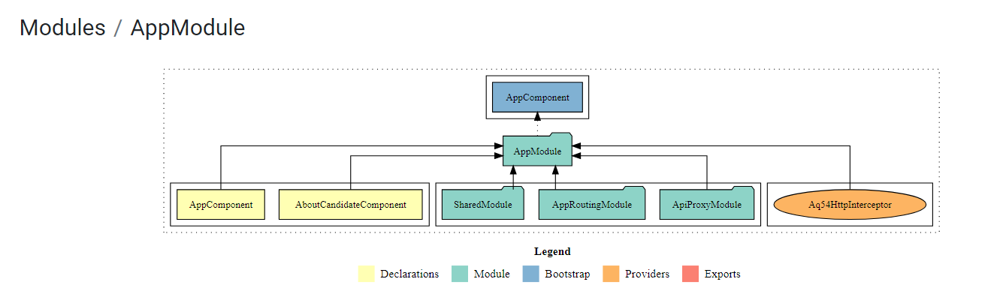
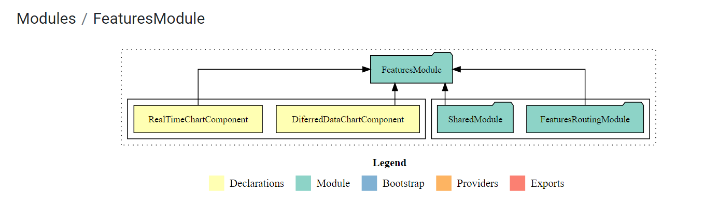
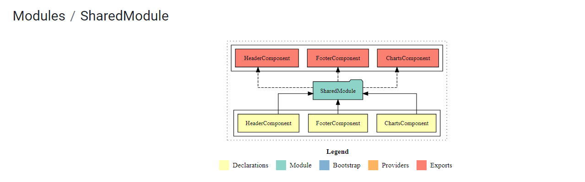
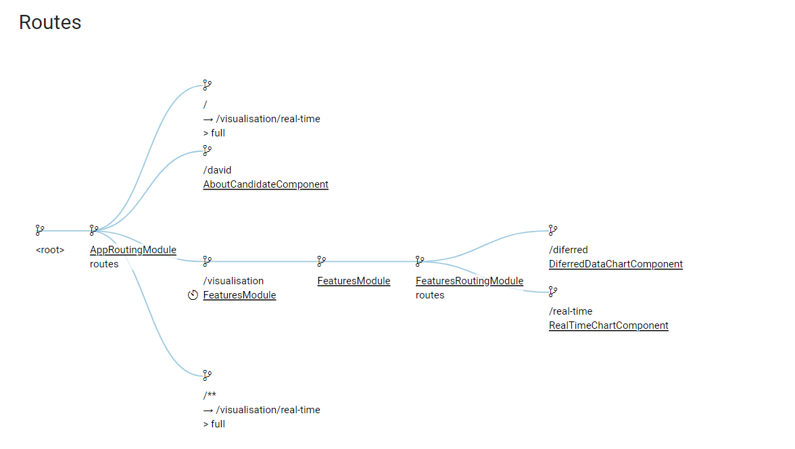
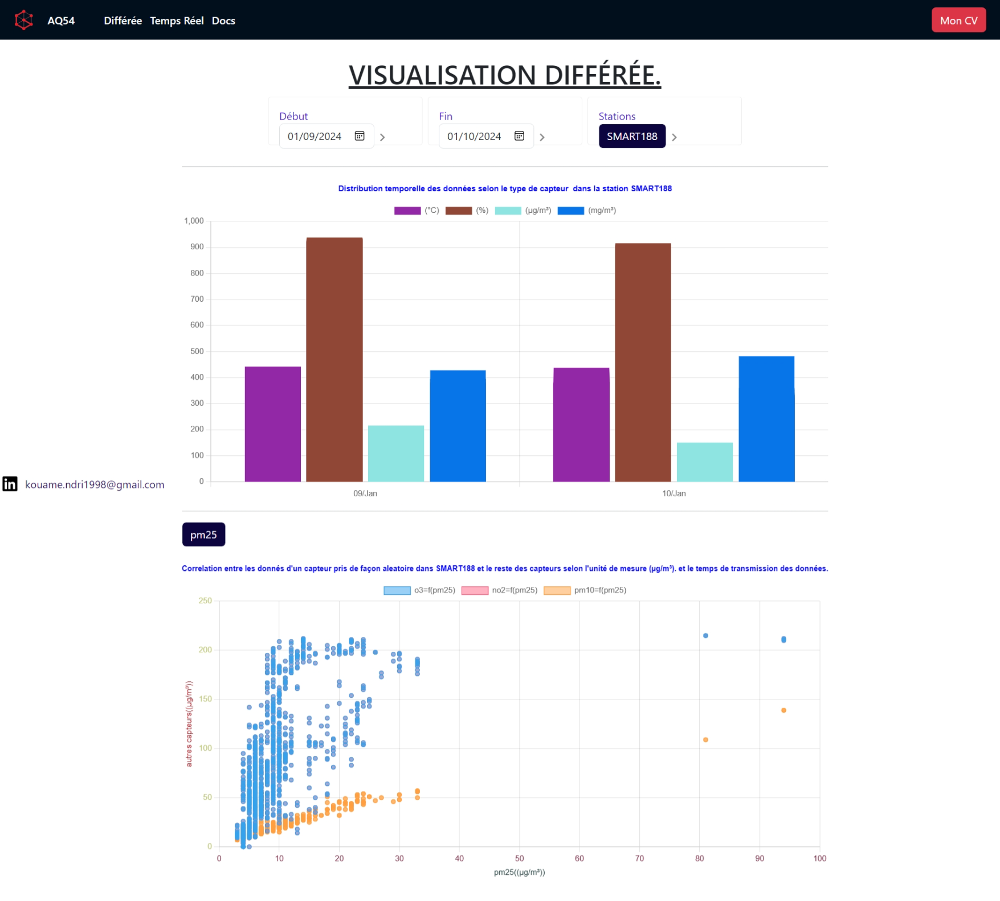

# AQ54 Data Visualization App with Angular and Docker-Compose and Nodejs

## Overview

This repository contains the source code and configurations for AQ54 data visualization app built with Angular, Docker-Compose,
 Node.js, and the AirQino API. The app is designed to fetch and display air quality data in a visually appealing manner.
 AirQino is a high-precision environmental monitoring platform, born from the need to create a network of stations for accurately assessing the quality of urban environment.
 for maore detail about AirQuino you can navigate to [airqino](https://www.airqino.it).
 This repository is a well structured code based on clean Architecture in conjunction with SOLID principles
 [clean architecture](https://www.educative.io/blog/clean-architecture-tutorial)

## Prerequisites

Before running the application, make sure you have the following software installed on your machine:

- [Docker](https://www.docker.com/)
- [Docker-Compose](https://docs.docker.com/compose/)
- [Node.js](https://nodejs.org/)(version 16 or latest)
- [Angular](https://github.com/angular/angular-cli) (version 12.2.18)
- Code editor of your choice (e.g., Visual Studio Code)  

## Getting Started

1. Clone the repository:

   ```bash
   git clone https://github.com/NdriAriel/technical-challenge-data354.git
  
   ````

2. change directory

   ```bash
   cd technical-challenge-data354
   ```

## Docker-Compose Configuration

The `docker-compose.yml` file defines the services, networks, and volumes needed for the application. It includes the following services:

- **aq54prod**: AQ54 app server made of  nodejs.
- **aq54docprod**: well structured documentation for AQ54 App.
- **aq54frontend**: this is the Angular based frontend of AQ54 data visualisation app.
  
1. Start the Docker containers:

   ```bash
   sudo docker-compose build 

   sudo docker-compose up 
   ```

2. output of docker-compose up


3. Open your web browser and navigate to [http://localhost:8000](http://localhost:8000) to access the Data Visualization App
4. Open your brower and navigate to ['http://localhost:8001](http://localhost:8001) to access the Data Visualisation App    documentation

## Project Structure  



  





## AQ54 Data visualisation app user interface


  

## Maintenance and Support

For additional information or support, please contact the maintainers of this repository:

- David Kouamé N'DRI <kouame.ndri1998@gmail.com>

## License

This project is licensed under the MIT License - see the [LICENSE](LICENSE) file for details.
